# 插件帮助<Badge type="tip" text="简单" />

## 请为你的插件添加帮助！

一个优秀的帮助可以让用户更好的理解插件的功能，Core也提供相应的自身命令`帮助`&`管理帮助`

<details><summary>帮助</summary><p>
<a></a>
</p></details>

<details><summary>管理帮助</summary><p>
<a>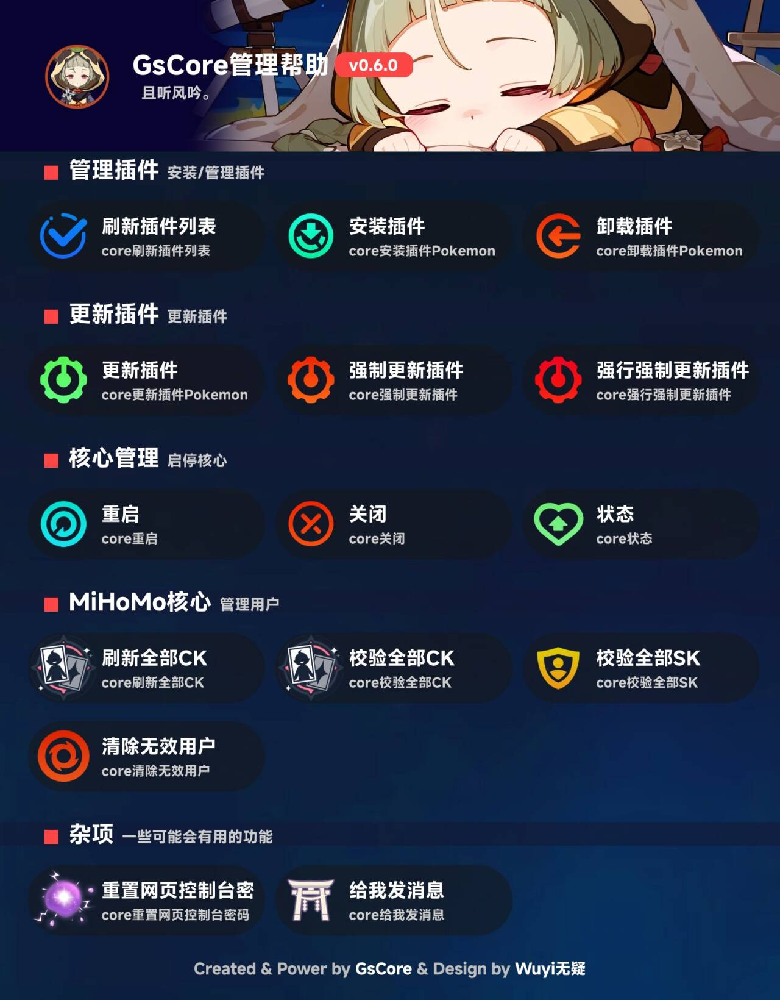</a>
</p></details>

## 插件添加漂亮的帮助图非常简单！

在GsCore中，绘制类似上述的帮助图有单独的函数协助，所以已经尽可能的简单！

以雀魂插件([MajsoulUID](https://github.com/KimigaiiWuyi/MajsoulUID))为参考，下面是该插件的外助图

<details><summary>雀魂帮助</summary><p>
<a>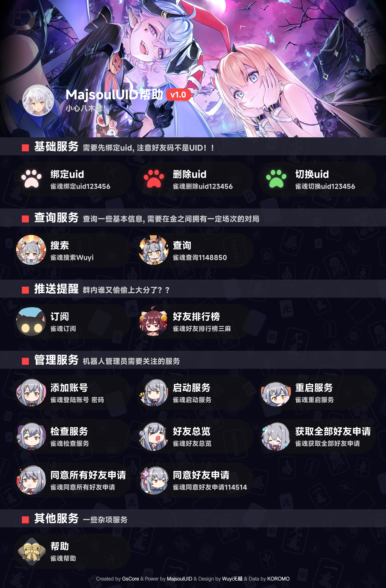</a>
</p></details>

1. 准备帮助的文件`help.json`, 这里给出[参考](https://github.com/KimigaiiWuyi/MajsoulUID/blob/main/MajsoulUID/majs_help/help.json)，请注意，该文件中的【任何命令】**不需要**添加前缀！
2. 准备相应的文件素材，这里有一份[范例](https://github.com/KimigaiiWuyi/MajsoulUID/tree/main/MajsoulUID/majs_help/texture2d)，素材`banner_bg`和`bg`的宽度请尽可能保持为`1545`！

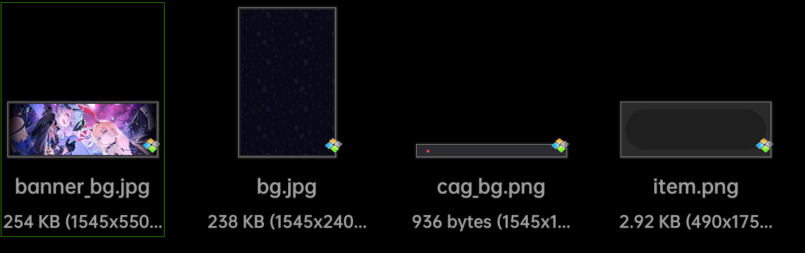

3. 准备相应的图标素材，这里有一份[范例](https://github.com/KimigaiiWuyi/MajsoulUID/tree/main/MajsoulUID/majs_help/icon_path), 注意图标大小恒定为150x150，且为PNG透明底！

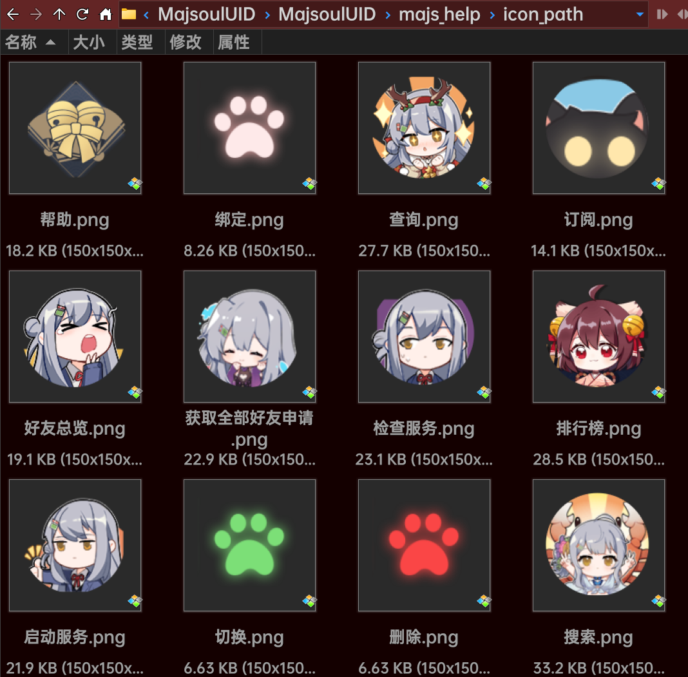


4. 编写函数，同样是[参考](https://github.com/KimigaiiWuyi/MajsoulUID/blob/main/MajsoulUID/majs_help/get_help.py)，可以直接复制修改

```python
from typing import Dict
from pathlib import Path

import aiofiles
from PIL import Image
from msgspec import json as msgjson
from gsuid_core.sv import get_plugin_available_prefix
from gsuid_core.help.model import PluginHelp
from gsuid_core.help.draw_new_plugin_help import get_new_help

from ..utils.image import get_footer
from ..version import MajsoulUID_version

ICON = Path(__file__).parent.parent.parent / 'ICON.png'
HELP_DATA = Path(__file__).parent / 'help.json'
ICON_PATH = Path(__file__).parent / 'icon_path'
TEXT_PATH = Path(__file__).parent / 'texture2d'

# 使用Core内置函数`get_plugin_available_prefix`获取插件可用的前缀
PREFIX = get_plugin_available_prefix('MajsoulUID')


# 使用aiofiles异步读取help.json文件
async def get_help_data() -> Dict[str, PluginHelp]:
    async with aiofiles.open(HELP_DATA, 'rb') as file:
        return msgjson.decode(await file.read(), type=Dict[str, PluginHelp])


async def get_help():
    return await get_new_help(
        # 插件名
        plugin_name='MajsoulUID',
        # 插件的badge, 会出现在帮助图title的右边的色块
        # 该值是一个dict, key为内容, value为色块颜色（RGB数组或者字符串）
        plugin_info={f'v{MajsoulUID_version}': ''},
        # 插件的logo
        plugin_icon=Image.open(ICON),
        # 之前准备的help.json文件
        plugin_help=await get_help_data(),
        # 插件的前缀, 哪怕存在用户自定义, 也可以让帮助图可以给出正确的命令
        plugin_prefix=PREFIX,
        # 主题, 暂时只影响整体的文字颜色, 如果是dark, 文字则为白色, light则为黑色
        help_mode='dark',
        # 帮助图最上面的部分, 一些精彩的插画非常适合, 注意处理宽度为1545
        banner_bg=Image.open(TEXT_PATH / 'banner_bg.jpg'),
        # 帮助图最上面部分的副标题, 可以写一些个性化内容
        banner_sub_text='小心八木唯！',
        # 帮助图背景, 注意处理宽度为1545! 
        # 请尽量使用纯色背景, 如果是插画, 尽量添加高斯模糊或者颜色遮罩!
        help_bg=Image.open(TEXT_PATH / 'bg.jpg'),
        # 分类的横幅, 注意处理宽度为1545! 
        cag_bg=Image.open(TEXT_PATH / 'cag_bg.png'),
        # 单个命令的底部图片, 大小为490x175
        item_bg=Image.open(TEXT_PATH / 'item.png'),
        # 命令图标包, 大小为150x150
        icon_path=ICON_PATH,
        # 页脚
        footer=get_footer(),
        # 是否允许缓存, 或者每次使用命令均重新绘制（建议使用缓存）
        enable_cache=True,
    )
```

## 不想准备素材和图标包？

当然可以! 函数`get_new_help()`有丰富的默认参数，你只需要准备`help.json`即可！

```python
async def get_help():
    return await get_new_help(
        plugin_name='MajsoulUID',
        plugin_info={f'v{MajsoulUID_version}': ''},
        # 图标
        plugin_icon=Image.open(ICON),
        # 你的帮助内容
        plugin_help={},
    )
```

## 下面是一些插件的帮助图范例

<details><summary>BA帮助</summary><p>
<a>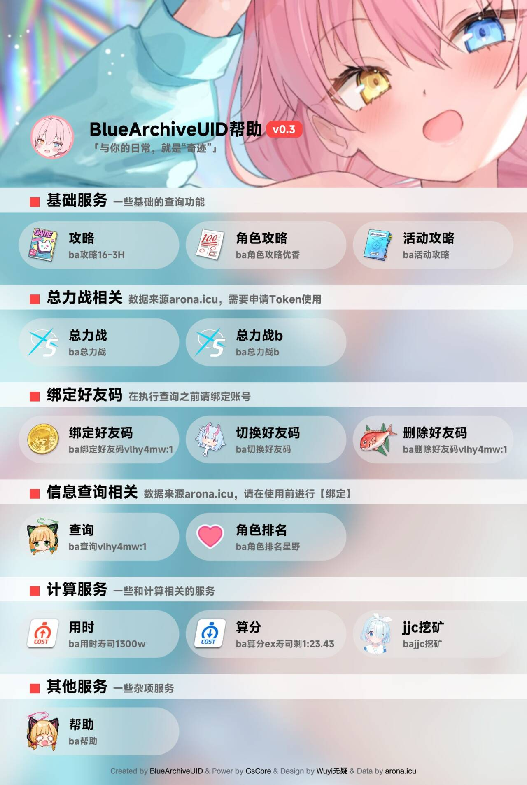</a>
</p></details>

<details><summary>鸣潮帮助</summary><p>
<a>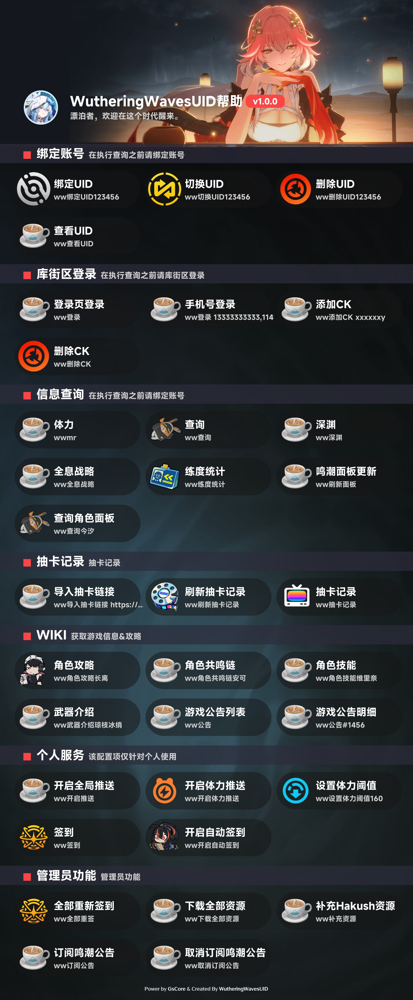</a>
</p></details>

<details><summary>ZZZ帮助</summary><p>
<a>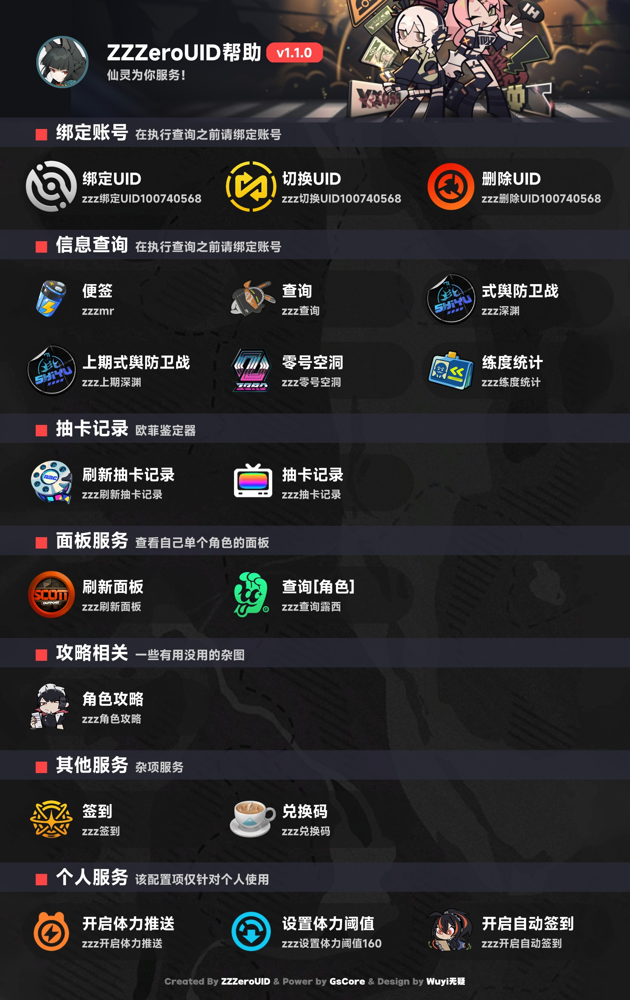</a>
</p></details>


::: tip

图标包内图片的名字并不一定需要完全依照`help.json`中的`name`去设定

core在寻找图标的时候按照以下优先级顺序执行：

- 先找路径中是否存在**完全一样名字**的ICON文件
- 再找路径中是否存在**部分一致的**的ICON文件
- 再找路径中文件名为`通用.png`的文件
- 随机挑选一张

:::


### 下面是一些插件的图标包

[本体](https://github.com/Genshin-bots/gsuid_core/tree/master/gsuid_core/help/new_icon)

[GenshinUID](https://github.com/KimigaiiWuyi/GenshinUID/tree/v4/GenshinUID/genshinuid_help/icon_path)

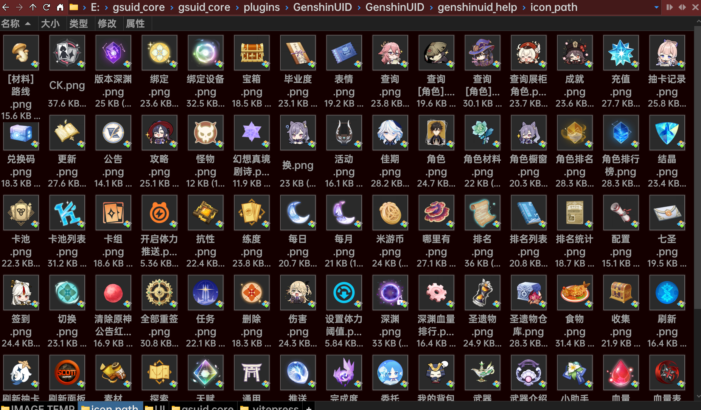

[StarRailUID](https://github.com/baiqwerdvd/StarRailUID/tree/master/StarRailUID/starrailuid_help/icon_path)

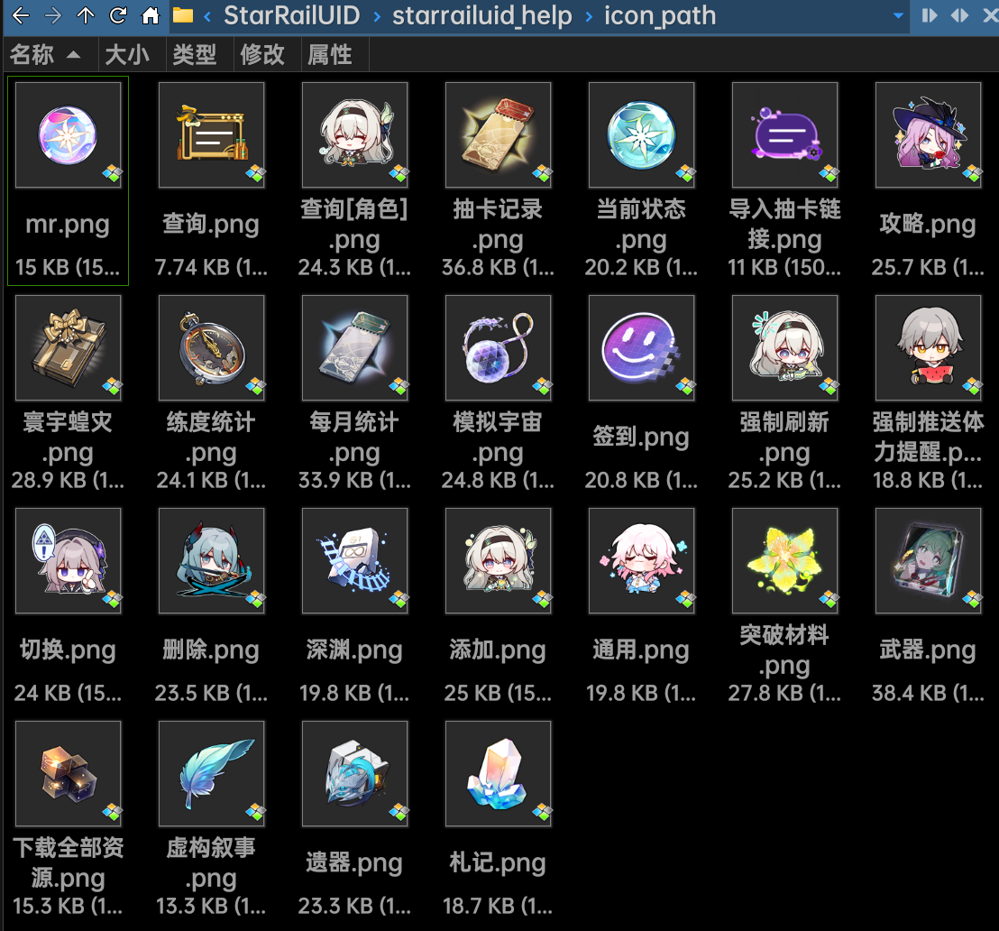

[WutheringWavesUID](https://github.com/tyql688/WutheringWavesUID/tree/master/WutheringWavesUID/wutheringwaves_help/icon_path)

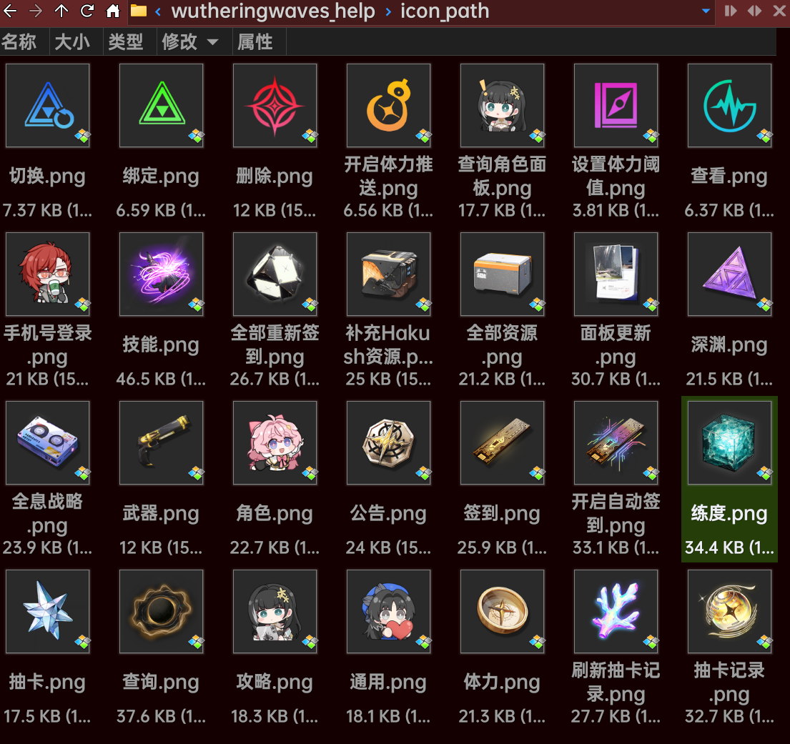

[MajsoulUID](https://github.com/KimigaiiWuyi/MajsoulUID/tree/main/MajsoulUID/majs_help/icon_path)

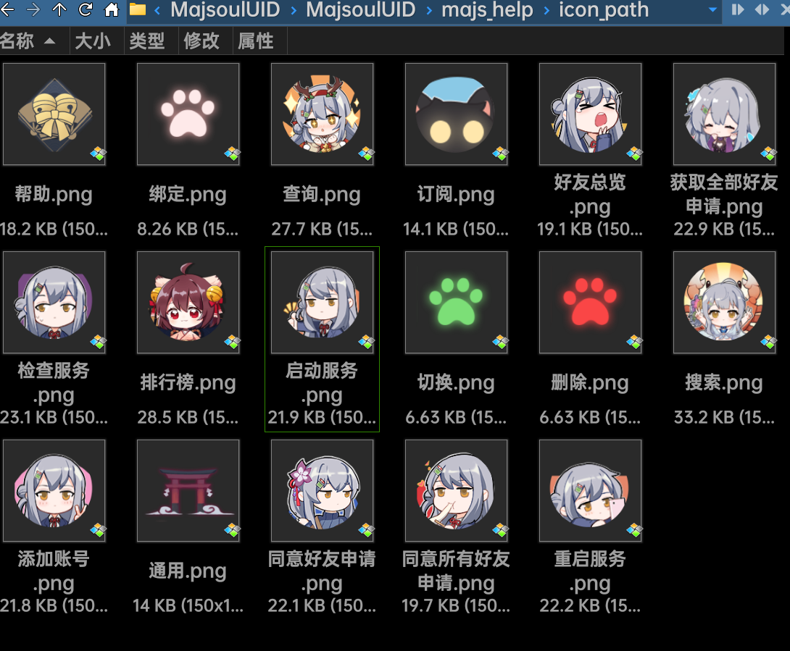
