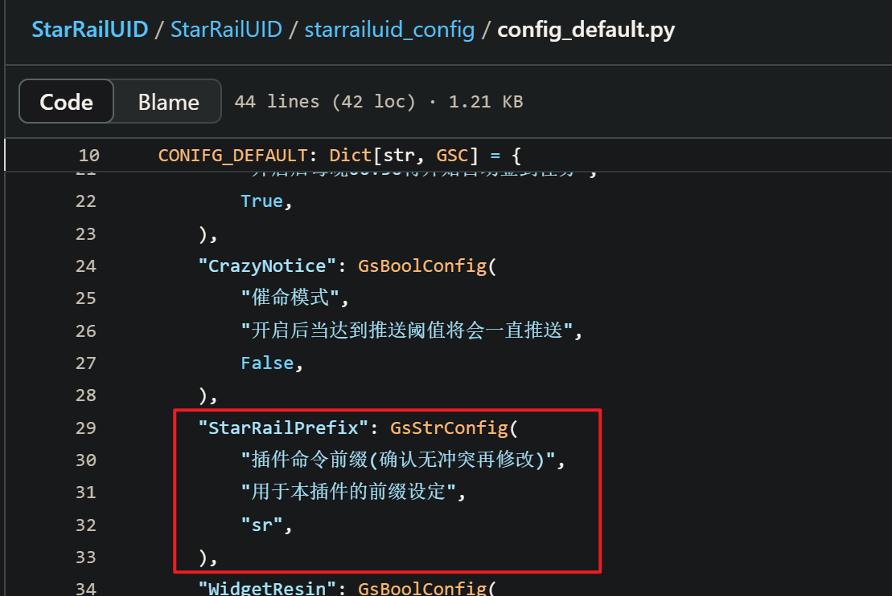
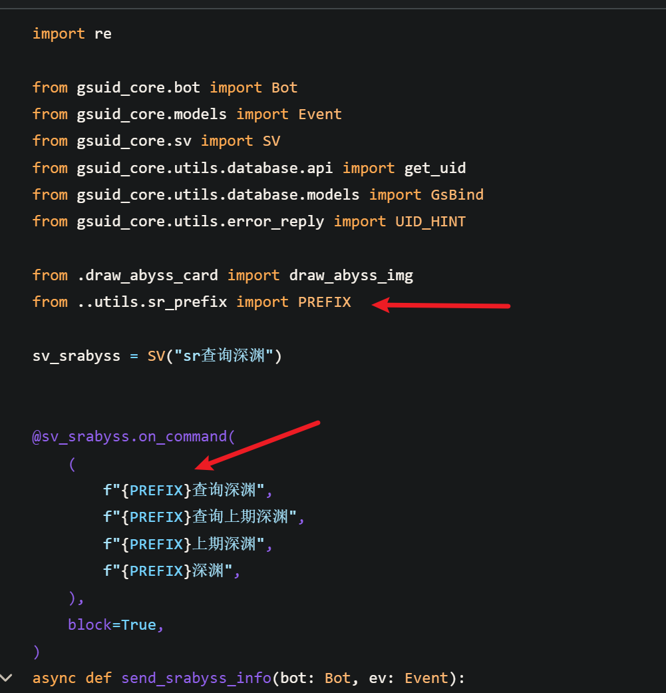
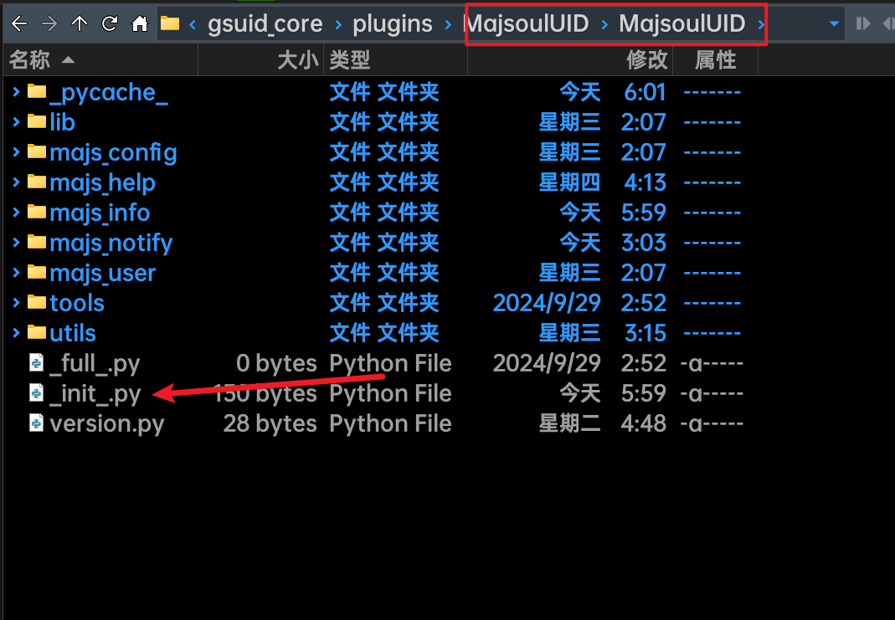
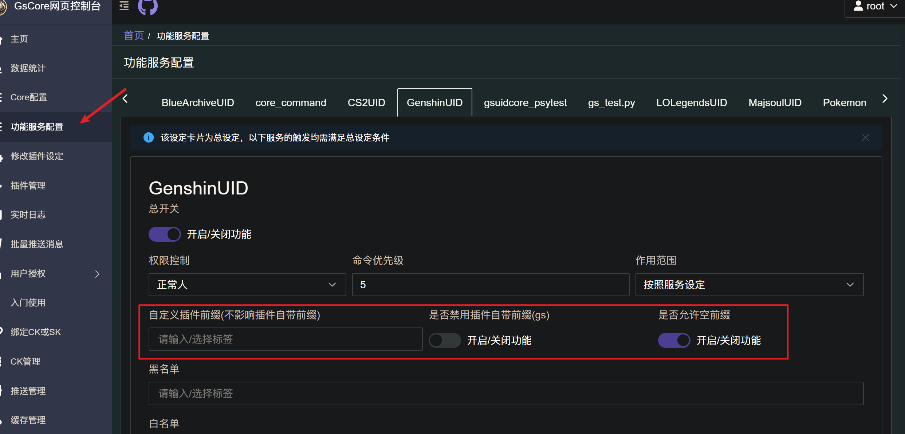

# 插件前缀<Badge type="tip" text="简单" />

## 请为你的插件添加前缀

在编写插件时，你可能需要为你的插件设置一个前缀，这有很多好处！

- 避免不同插件之间的相互影响！
- 给予用户方便的设置/调控

## 旧的方法

在`2024/10/1`之前，你可能在插件内自己配置了一个`PREFIX`变量，并将其添加至插件独立配置中，这样做的好处有：

- 插件独立，不受Core的影响
- 较为灵活的调控

但是坏处也有：

- 每个服务的命令行均需要设置`f"{PREFIX}{你的命令}"`，较为繁琐
- 需要大量额外代码，以适配多前缀、空前缀、无前缀





## 新的方法

在`2024/10/1`之后，你可以在你插件的起始位置`__init__.py`添加代码，让GsCore为你处理这些事情！



这里给出[参考](https://github.com/KimigaiiWuyi/MajsoulUID/blob/main/MajsoulUID/__init__.py), 该插件实现了**插件内任意命令**均需要携带前缀`雀魂`或者`qh`

```python
from gsuid_core.sv import Plugins

Plugins(
    name="MajsoulUID", force_prefix=['雀魂', 'qh'], allow_empty_prefix=False
)
```

## Plugins

⬇ 注意，在`Plugins`类中有多项参数，但是大多数无需关心，下面将一一介绍：

::: warning

`Plugins`类中的大多数参数将会在首次启动后写入`config.json`，以方便用户修改和调控

也就是说，之后如果你再次修改该值，则：

- **只会影响**首次安装你插件的用户
- 已安装用户更新插件之后**不会**有任何变化！！

在下面的介绍中，如果**没有特别标注**，则为【首次启动后将该值写入config.json】

那么请谨慎决定该值的初始值！！

:::

```python
class Plugins(
    # name决定了插件的名称, 也是唯一标识符, 请【永远】使用你插件包的文件夹名称作为插件注册名
    name: str = '',
    # pm决定了该插件的权限, 默认为6, 即任何人都可以使用
    pm: int = 6,
    # pm决定了该插件的优先级, 默认为5
    priority: int = 5,
    # enabled决定了该插件是否启用, 默认为True
    enabled: bool = True,
    # area决定了该插件的作用范围, 默认为SV, 即按照插件内服务的设定影响
    area: Literal['GROUP', 'DIRECT', 'ALL', 'SV'] = 'SV',
    # black_list(List[str])决定了该插件的黑名单, 默认为空列表, 可以写入群号/用户ID
    black_list: List[Unknown] = [],
    # white_list(List[str])决定了该插件的白名单, 默认为空列表, 【优先级高于黑名单】
    white_list: List[Unknown] = [],
    # sv无需关心
    sv: Dict[Unknown, Unknown] = {},
    # 用户自定义前缀, 默认为空列表
    prefix: List[str] | str = [],
    # 插件作者自定义前缀, 【该值不会写入`config.json`】, 大多数情况值得插件作者信赖
    force_prefix: List[str] = [],
    # 是否【关闭插件作者自定义前缀】, 默认为False
    disable_force_prefix: bool = False,
    # 是否【允许空前缀】, 不会影响其他前缀, 只是允许空前缀
    allow_empty_prefix: bool | None = None,
    # force无需关心, 也永远不要自定义
    force: bool = False
)
```


